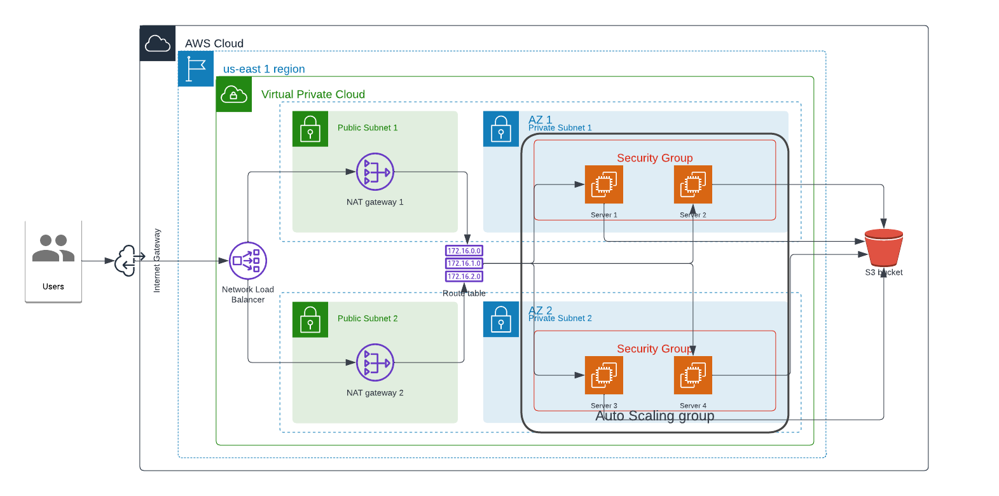

# Udacity Clod Engineer Project Two - Deploy a High-Availability Web App using CloudFormation 



This project is the second project in the Cloud DevOps Engineer Nanodegree program which requires that I use my knowledge of Infrastructure as Code (IoC) to design and develop and deploy a website called udagram using Cloud formation. EC2 instances, Load balancers, Internet gateways, VPC, Private and Public Subnets among other AWS cloud infrastructure were coded in the projectTwo.yml file as against using the AWS console.

Load balancer Link: [Here](http://udagr-WebAp-RQGFQKKCSG5K-279635589.us-east-1.elb.amazonaws.com/uliya-html)

Files uploaded and used for the project include
1. The actual HTML/CSS and Javascript file as a zip folder
2. The yaml file -  projectTwo.yml
3. The json file - projectTwo.json
4. Architechtural Diagram - projectTwoDiagram.png
5. Deployment script - create.sh
6. Update script - update.sh

## Deployment:

Just run;
```sh
./create.sh udagram projectTwo.yml projectTwo.json
```